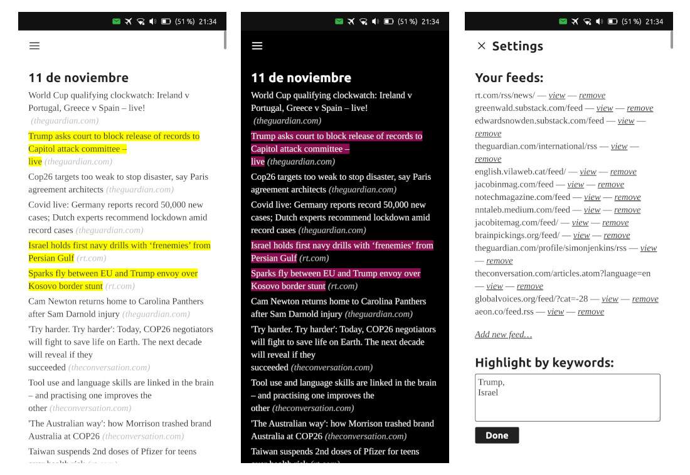

# headline


(icon by the [Numix Project](https://github.com/numixproject/numix-icon-theme-square) - GPL-3.0)

[](https://open-store.io/app/headline.collaproductions)

headline is a minimal progressive web app for Ubuntu Touch intended to make your news consumption simple and easy, without unnecessary bells and whistles. It displays the headlines of your favourite news sites and it can highlight headlines containing any keywords as requested. The news articles can be visited and read without having to switch applications.

It is based on the work of [zserge](https://zserge.com/posts/rss/) with some small modifications (like a dark mode button and some style improvements).

### Building the app (Ubuntu-based distros)

Install [clickable](https://clickable-ut.dev/en/latest/install.html):

```
$ sudo add-apt-repository ppa:bhdouglass/clickable
$ sudo apt-get install clickable
```

Clone this repository and build:

```
$ git clone https://github.com/nicolascolla/headline.git
$ cd headline
$ clickable
```

The resulting click package will be found under build/all/app.

### Screenshots


